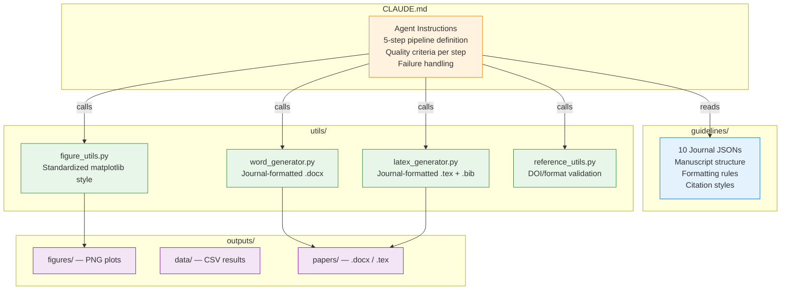

<div align="center">

# PaperFactory

**AI agent that writes research papers for structural engineering.**

Tell it your topic and target journal — it handles the rest.

[](https://www.python.org/)
[](https://docs.anthropic.com/en/docs/claude-code)
[](LICENSE)
[](#supported-journals)
[](#project-structure)

</div>

---

## What It Does

PaperFactory is a **Claude Code native agent** that automates the full lifecycle of research paper writing — from literature search to a submission-ready manuscript. You have a natural conversation in your terminal: describe your research topic, pick a journal, and the agent executes a 5-step pipeline, asking for your approval at every stage.

```
You: "고층건물 풍압계수의 ML 예측" 주제로 JWEIA에 낼 논문 써줘

PaperFactory: [searches 15+ real papers] → [designs methodology] → [writes & runs Python code]
             → [analyzes results] → [generates JWEIA-formatted Word document]
```

---

## How It Works


Each step runs inside Claude Code using native tools:

| Step | What Happens | Tools Used |
|:----:|:-------------|:-----------|
| **1** | Searches Google Scholar, ScienceDirect for real papers. Collects 15+ references with DOIs. Identifies research gaps. | `WebSearch` `WebFetch` |
| **2** | Designs hypothesis, methodology, experiment plan. Plans 6+ figures and 3+ tables. Checks journal scope fit. | `Read` (guidelines JSON) |
| **3** | Writes Python code, executes it, auto-debugs errors (up to 5 retries). Generates publication-quality figures. | `Bash` `Write` |
| **4** | Statistical interpretation, comparison with prior work, honest limitations. Drafts Results & Discussion. | `Read` (outputs) |
| **5** | Assembles full manuscript per journal guidelines. Validates references. Exports Word (default) or LaTeX. | `utils/` |

> **Human-in-the-loop**: After each step, you review the output and can request changes before proceeding.

---

## Supported Journals

<table>
<tr>
<td>

| Journal | Key | Field |
|:--------|:----|:------|
| ASCE J. Structural Engineering | `asce_jse` | Structural |
| ACI Structural Journal | `aci_sj` | Concrete |
| J. Wind Eng. & Ind. Aerodynamics | `jweia` | Wind |
| J. Building Engineering | `jbe` | Building |
| Engineering Structures | `eng_structures` | Structural |

</td>
<td>

| Journal | Key | Field |
|:--------|:----|:------|
| Earthquake Eng. & Struct. Dynamics | `eesd` | Seismic |
| Thin-Walled Structures | `thin_walled` | Structural |
| Cement & Concrete Composites | `cem_con_comp` | Concrete |
| Computers & Structures | `comput_struct` | Computational |
| Automation in Construction | `autom_constr` | AI + Construction |

</td>
</tr>
</table>

Each journal has a detailed JSON guideline file in `guidelines/` covering: manuscript structure, formatting (font, spacing, margins), citation style, figure/table rules, and submission requirements.

---

## Quick Start

### 1. Install

```bash
# Install Claude Code CLI
npm install -g @anthropic-ai/claude-code

# Clone and set up PaperFactory
git clone https://github.com/concrete-sangminlee/paperfactory.git
cd paperfactory
pip install -r requirements.txt
```

### 2. Run

```bash
claude
```

### 3. Tell it what you want

```
> "Deep learning-based seismic damage detection in RC frame structures" 주제로
  Engineering Structures 저널에 낼 논문 써줘
```

Claude will execute the 5-step pipeline, showing results and asking for your approval at each step. The final `.docx` file appears in `outputs/papers/`.

---

## Example Topics

<table>
<tr>
<td width="50%">

**Wind Engineering**
> CFD-validated ML model for across-wind response prediction of super-tall buildings above 300m

**Seismic Engineering**
> Deep learning-based rapid seismic damage assessment of RC frame structures using acceleration sensor data

</td>
<td width="50%">

**Concrete**
> Ensemble ML prediction of compressive strength of recycled aggregate concrete with fly ash and slag

**AI + Structural**
> Physics-informed neural network for real-time structural health monitoring of cable-stayed bridges

</td>
</tr>
</table>

---

## Architecture



---

## Utilities

PaperFactory includes Python utilities that Claude calls during the pipeline. They can also be used independently in your own research scripts.

<details>
<summary><b>figure_utils.py</b> — Publication-quality figure styling</summary>

```python
from utils.figure_utils import setup_style, save_figure, get_colors, get_figsize

setup_style()                        # Times New Roman, DPI 300, inward ticks
colors = get_colors()                # 8 distinct colors (B&W print safe)
w, h = get_figsize("single")        # 3.5 x 2.8 in (single column)

fig, ax = plt.subplots(figsize=get_figsize("double"))
ax.plot(x, y, color=colors[0])
save_figure(fig, "fig_1_model_comparison")   # → outputs/figures/
```

| Size Preset | Dimensions | Use Case |
|:------------|:-----------|:---------|
| `single` | 3.5 x 2.8 in | Single column figure |
| `double` | 7.0 x 4.5 in | Full width figure |
| `square` | 3.5 x 3.5 in | Correlation plots |

</details>

<details>
<summary><b>word_generator.py</b> — Journal-formatted Word documents</summary>

```python
from utils.word_generator import generate_word

paper_content = {
    "title": "Paper Title",
    "authors": "A. Author, B. Author",
    "abstract": "Abstract text...",
    "keywords": "keyword1; keyword2",
    "sections": [
        {"heading": "INTRODUCTION", "content": "...", "subsections": [
            {"heading": "Background", "content": "..."},
        ]},
    ],
    "tables": [{"caption": "Table 1.", "headers": ["A", "B"], "rows": [["1", "2"]]}],
    "references": ["[1] Author, Title, Journal..."],
    "data_availability": "Data available on request.",
}

output_path = generate_word(paper_content, "asce_jse", figures=["outputs/figures/fig1.png"])
```

</details>

<details>
<summary><b>latex_generator.py</b> — LaTeX + BibTeX output</summary>

```python
from utils.latex_generator import generate_latex

tex_path, bib_path = generate_latex(paper_content, "eng_structures", figures=["fig1.png"])
# → outputs/papers/Paper_Title_eng_structures.tex
# → outputs/papers/Paper_Title.bib
```

Automatically selects document class: `elsarticle` (Elsevier), `ascelike` (ASCE), `article` (others).

</details>

<details>
<summary><b>reference_utils.py</b> — Reference validation</summary>

```python
from utils.reference_utils import validate_references, check_duplicates

issues = validate_references(refs, guideline)    # Missing DOI, year, etc.
dupes = check_duplicates(refs)                   # Duplicate detection
```

</details>

---

## Usage Tips

**Be specific with your topic** — the more precise, the better the output:

| Instead of... | Try... |
|:--------------|:-------|
| "ML for structures" | "Gradient boosting prediction of lateral drift in RC shear walls under cyclic loading" |
| "Wind on buildings" | "CFD-validated ML surrogate for across-wind response of super-tall buildings above 300m" |

**Request changes at any step** — Claude waits for your approval:
- "Add more references on LSTM-based structural monitoring."
- "Change methodology to Random Forest instead of neural networks."
- "Figures look good. Proceed."

**Output locations:**
| Type | Path |
|:-----|:-----|
| Figures | `outputs/figures/*.png` |
| Data | `outputs/data/*.csv` |
| Papers | `outputs/papers/*.docx` or `*.tex` |

---

## Project Structure

```
paperfactory/
├── CLAUDE.md               # Agent instructions (pipeline + quality criteria)
├── README.md
├── requirements.txt        # python-docx, pandas, numpy, scikit-learn, matplotlib, scipy, seaborn
├── guidelines/             # 10 journal guideline JSON files
├── utils/
│   ├── word_generator.py   # Word document builder
│   ├── latex_generator.py  # LaTeX + BibTeX builder
│   ├── figure_utils.py     # Matplotlib style standardization
│   └── reference_utils.py  # Reference format validation
├── tests/                  # 43 unit tests
└── outputs/
    ├── figures/            # Generated plots (DPI 300)
    ├── data/               # Result CSVs and JSONs
    └── papers/             # Final .docx and .tex files
```

---

## Troubleshooting

| Problem | Solution |
|:--------|:---------|
| `claude: command not found` | `npm install -g @anthropic-ai/claude-code` and add Node.js bin to PATH |
| Authentication errors | Run `claude login` and follow the browser prompt |
| `ModuleNotFoundError` | `pip install -r requirements.txt` (use a virtual environment) |
| WebSearch not working | Allow web access when prompted. Requires Claude Max Plan. |

---

## Requirements

- **[Claude Code CLI](https://docs.anthropic.com/en/docs/claude-code)** — `npm install -g @anthropic-ai/claude-code`
- **Claude subscription** — Max Plan recommended for web search and extended sessions
- **Python 3.10+** — with `python-docx`, `pandas`, `numpy`, `scikit-learn`, `matplotlib`, `scipy`, `seaborn`
- **No API key needed** — Claude Code authenticates through your subscription

---

## Disclaimer

Papers generated by PaperFactory are AI-assisted drafts. They require thorough human review, verification, and refinement before submission. Always validate research results, citations, numerical claims, and conclusions independently.

---

<div align="center">

**MIT License** — see [LICENSE](LICENSE)

Built with [Claude Code](https://docs.anthropic.com/en/docs/claude-code)

</div>
